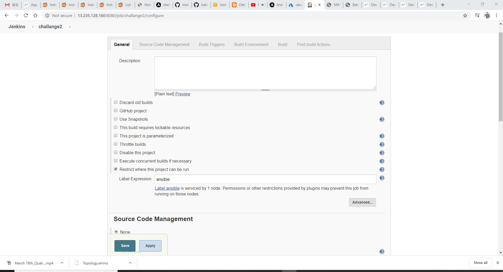
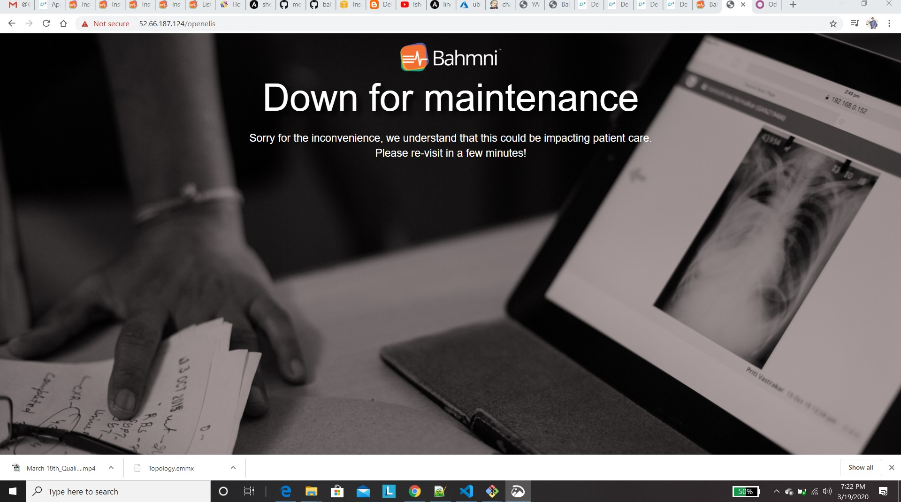

# Bhamani Application Deployment 

## Manual Installation
 - Create an Centos 7 instance with atleast 4 cores and 8 GB of RAM (t2.large)
 - Login into the centos instance become root user and install the following


```
yum install -y https://kojipkgs.fedoraproject.org//packages/zlib/1.2.11/19.fc30/x86_64/zlib-1.2.11-19.fc30.x86_64.rpm
 
yum install https://dl.bintray.com/bahmni/rpm/rpms/bahmni-installer-0.92-147.noarch.rpm
 
bahmni --help
curl -L https://tinyurl.com/yyoj98df >> /etc/bahmni-installer/setup.yml
cat /etc/bahmni-installer/setup.yml
 please read this document: https://bahmni.atlassian.net/wiki/display/BAH/List+Of+Configurable+Installation+Variables
#You can also configure custom inventory file instead of local.
echo "export BAHMNI_INVENTORY=local" >> ~/.bashrc
source ~/.bashrc
bahmni install 
yum list installed | grep bahmni
```

for Configurable Installation Variables [referhere](https://bahmni.atlassian.net/wiki/spaces/BAH/pages/53837974/List+Of+Configurable+Installation+Variables)

- edit the bellow content to /etc/bahmni-installer/setup.yml

```
timezone: Asia/Kolkata
implementation_name: default
selinux_state: enforcing
```

## after successful instlation Access the Application using 


## instalation using jenkins 

  - after successful manual instalation convert above manual steps to ansible play book 

  - the playbook look like this 

```
    - hosts: all
      remote_user: root
      tasks:
        - name: installation of Bahmni
          yum:
            name: https://kojipkgs.fedoraproject.org//packages/zlib/1.2.11/19.fc30/x86_64/zlib-1.2.11-19.fc30.x86_64.rpm
            state: present
        - name: Install the bahmni command line program
          yum:
            name: https://dl.bintray.com/bahmni/rpm/rpms/bahmni-installer-0.92-147.noarch.rpm
            state: present
        - name: Now setup a configuration file for bahmni command in /etc/bahmni-installer
          shell:
            cmd: curl -L https://tinyurl.com/yyoj98df >> /etc/bahmni-installer/setup.yml
        - name: appending
          copy:
            src: /home/devops/bahmni/setup.yml
            dest: /etc/bahmni-installer/setup.yaml
        - name: nventory file name to local in BAHMNI_INVENTORY
          shell:
            cmd: echo "export BAHMNI_INVENTORY=local" >> ~/.bashrc
        - name: nventory file name to local in BAHMNI_INVENTORY
          shell:
            cmd: source ~/.bashrc
        - name: Now fire the installer
          shell:
            cmd: bahmni install
```        

## steps to deploy 
 
  - take jenkins Master & ACS 
  - Add the acs  to the Jenkins master. Select Manage Jenkins => Manage Nodes => New Node


  - Create new Jenkins Freestyle project and restrict where this project is built in General Section




  - in the build section in jenkins select exucute shell and exucute bellow commands 

```
cd /home/devops/bahmni
ansible-playbook -i <inventroy> <your.yaml> -vvv
```

## after successful build Access the Application using centos public ip 


## End results 





## Verify installed components using the command in centos node


## jenkins output


